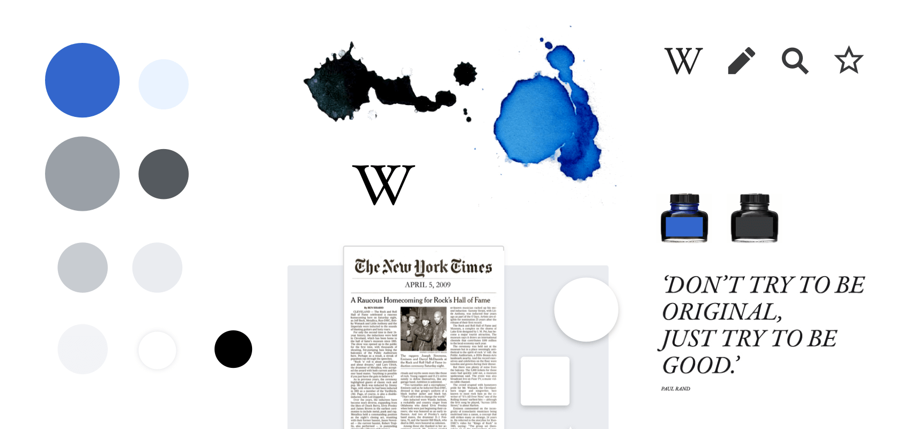

Every website is just text + images + style. That's it. There's an incredible amount of code that makes websites look all dynamic and pretty.

Basic Website Workflow
1. Write content in **HTML** files
	- HTML defines the structure, headings, paragraphs, links, etc.
2. Style with **CSS**
	- CSS defines the colors, layout, spacing, fonts, etc.
3. Add interactivity with **JavaScript** (optional)
	- JS creates buttons, forms, animations, etc.
4. Upload files to **hosting service**
	- *Free*: GitHub Pages, Netlify, Vercel
	- *Paid*: Any web host, cloud provider
5. Point **domain name** to hosted files
	- Buy from registrar (Namecheap, Google Domains)
	- Point to your hosting service via DNS

Frameworks (optional)
- **Static Site Generators** -- Enables the user to write in markdown, automatically converts markdown to HTML
	- e.g. Hugo, Jekyll, 11ty
- **WYSIWYG** -- Enables the user to use a GUI to write in, automatically converts that to HTML
	- e.g. WordPress

## My Setup
- Write in Markdown
- Hugo generates HTML/CSS
- Host on GitHub Pages
- Domain from Namecheap

## Examples of simple sites
- [The Best Motherfucking Website](https://thebestmotherfucking.website/)
- [Dead Simple Sites](https://deadsimplesites.com/)
- Wikipedia (simple, content-focused)

