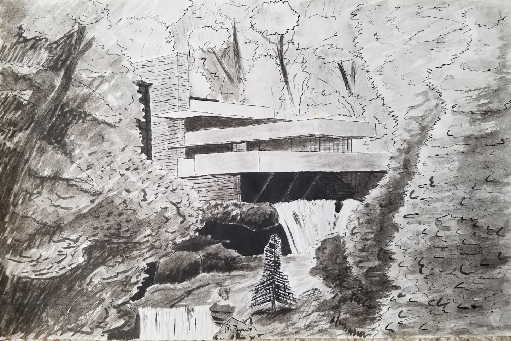
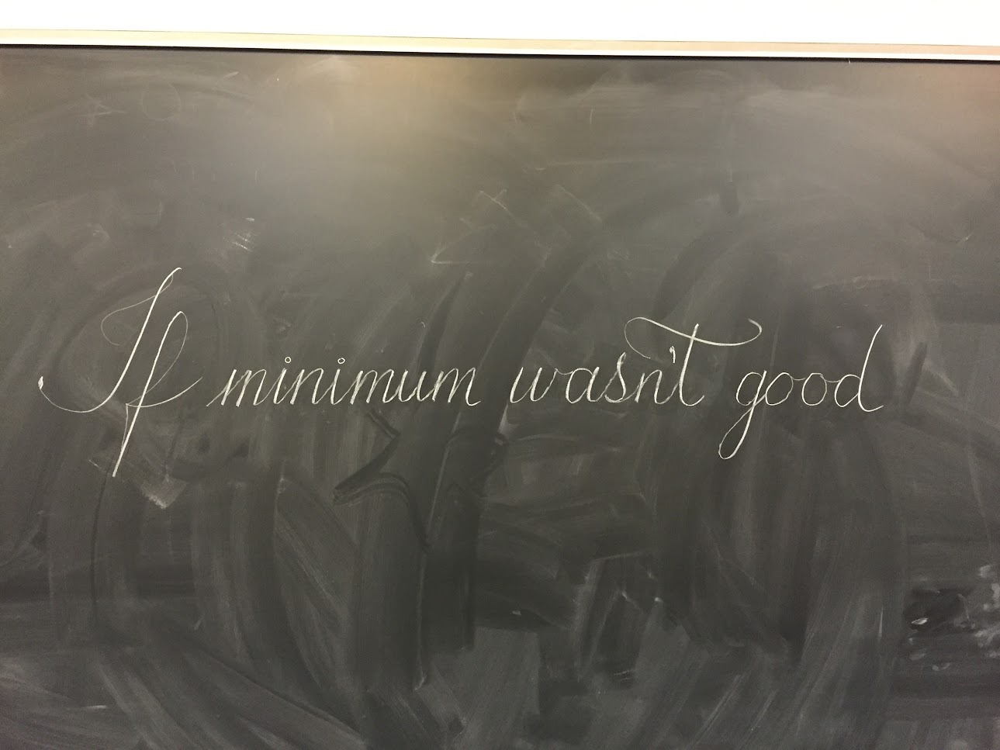
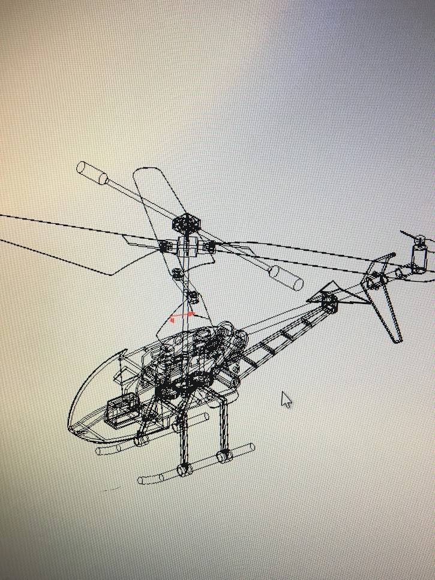
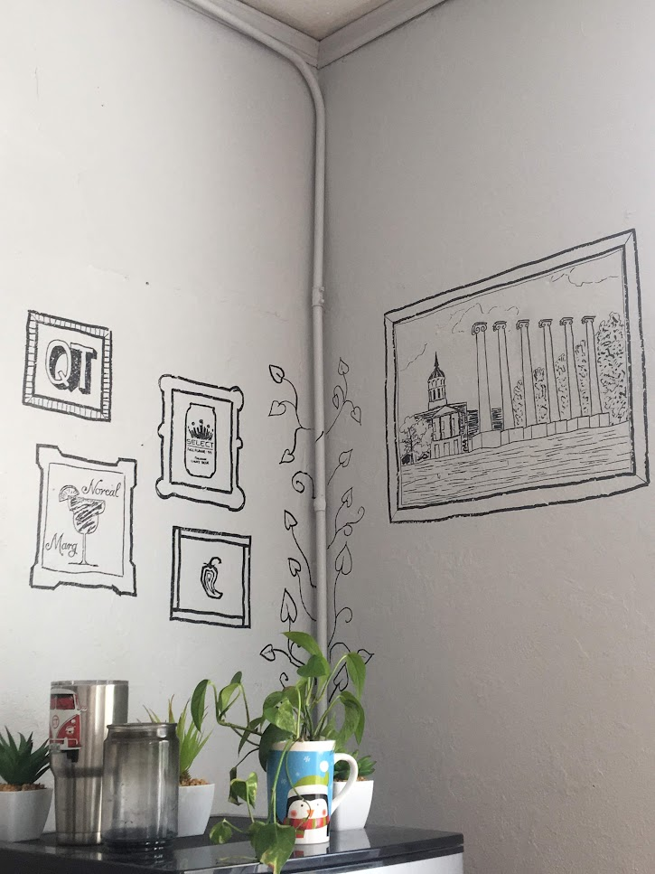
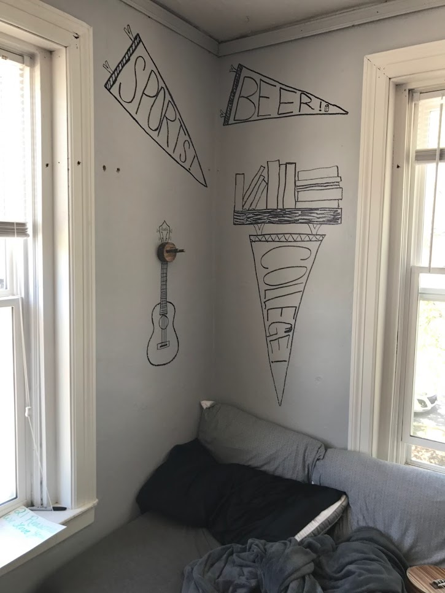
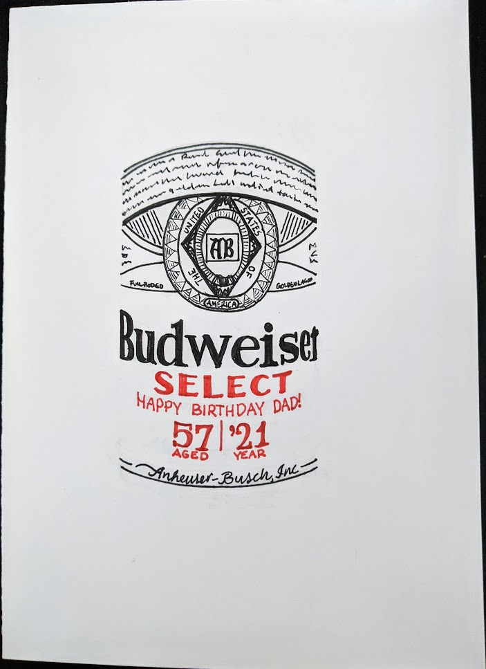
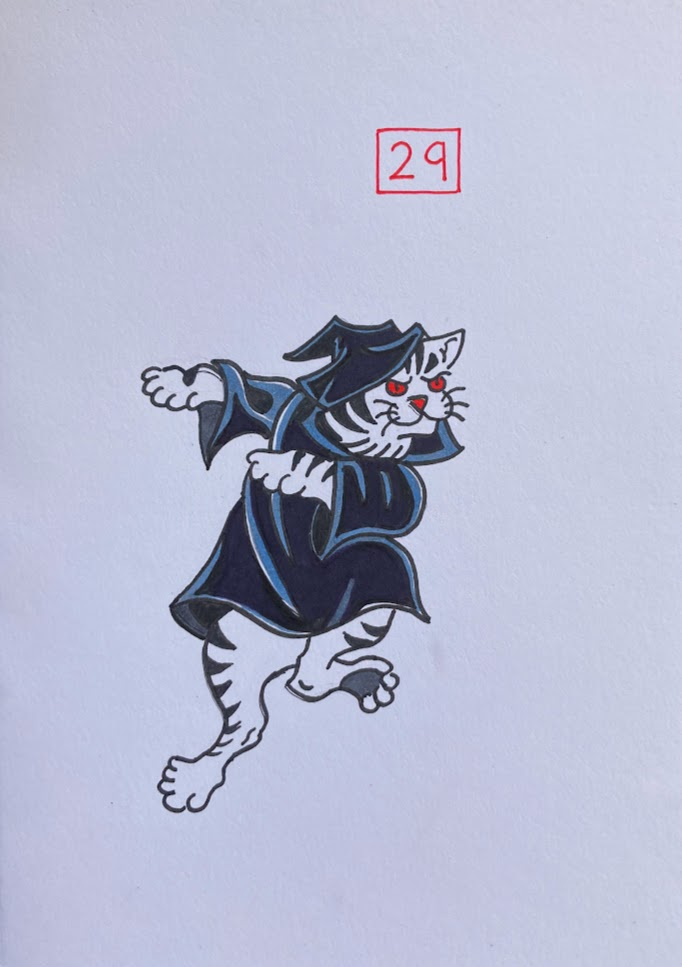

+++
title = "Drawing"
date = 2023-04-10
menu = "main"
+++

My favorite media are ink drawing and woodworking, here are a few of my best pieces from over the years. 

*Done using sharpie on paper, based on the houses from *Your Cabin in the Woods* by Conrad Meinecke.*

&nbsp;

*Done using a dip pen and black india ink. This is [Fallingwater](https://en.wikipedia.org/wiki/Fallingwater), a house designed by Frank Lloyd Wright in 1935.*

&nbsp;

*...enough, it wouldn't be the minimum. From [KISS](/blog/kiss)*

&nbsp;

*I particularly like black ink drawings with that bold, all-black shading style, though it's very hard to get right.*

&nbsp;

*On the flip side of that other doodle, I tried some pencil drawing, HB mechanicals don't get very dark...*

&nbsp;

*Digital logic class was getting boring.*

&nbsp;

*"There are good ships and wood ships, ships that sail the sea, but the best ships are friendships, may they always be!"*

&nbsp;

*Okay, a computer-aided drawing, but it looks dope.*

&nbsp;

---
## Sharpie on the Walls
Something about finals week always gave me bursts of creative energy. This time, two of my best friends and I decorated my frat house bedroom walls.

Fun anecdotes about that house:
- For a two month period, the front door was literally off the hinges after getting beaten down, and the back door "locked", but an nonlocking window right next to it allowed easy access
- My bedroom door had a one foot gap at the top that I had to duct tape over to prevent wasps from getting in. The wasps could stay in the hallway.
- The hot water was broken for three months during winter, fine by me.
- The house apparently didn't have heat, my bedroom stayed a cool 55 degF during the winter.
- During the summer, there was obviously no air conditioning, so the dudes that stayed there filled up a truck bed with ice, water, and natural lights to survive. 

*Can you tell what my priorities were back then?*

&nbsp;

*The pennants were done by Biggs.*

&nbsp;

*Why study when you can just give yourself the diploma already?*

&nbsp;

---
## Bday card series
Ink on paper, doesn't get better than that.

*Red balloons only*

&nbsp;

*Bud Select is a family tradition, and STL staple.*

&nbsp;

*One line, then three more in red.*

&nbsp;

*I need a boat.*

&nbsp;

*I copied a tattoo artist and added color, never making that mistake again.*

&nbsp;

*Haha, get it? Like spotify...*

&nbsp;

*I mean c'mon, I'm a minimalist, this one is my favorite.*

