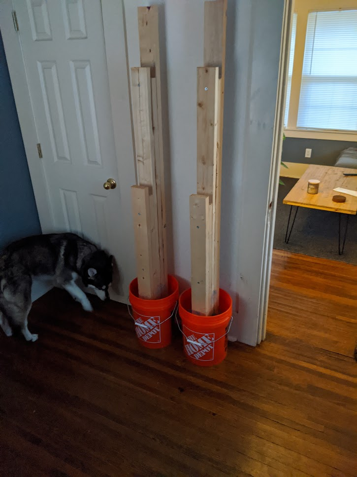

+++
title = "Inside-the-box thinking"
menu = "main"
date = "2024-08-15"
toc = "false"
+++

If you can build a box, you can build almost anything out of wood. Heck, a lot of the challenge in woodworking is making the most right right angles possible (yeah, you read that right).

I took shop in middle school and it taught me three things: how to not cut off my finger (unlike my teacher), how to sand for hours by hand, and how to build boxes.

For example, furniture. Most pieces of furniture, besides seating, are boxes. Bed frames, dressers, tables, coffee tables, media consoles, desks, shelves -- all boxes.

What changes from piece to piece then?

- **Size of the box**: length, width, height (X, Y, Z)
- **Number of boxes**: Pay attention in my photos to the arrangement of smaller boxes that comprise bigger boxes.
- **Arrangement**: One box on top of another? Side by side? Perhaps a more complex arrangement?

**Bud Select approved**. In the front, a two-layer box on top of some metal legs. In the back, two boxes side-by-side that share the same top, middle, and bottom pieces to save on cutting/screwing.

&nbsp;

**Actual 1-D Box**. Cut out of a sheet of 3/4" thick plywood.

&nbsp;

**Vertical Side by Side**. Other names aside, see the boxes? One box pulls out of the other box.

&nbsp;

**What in tarnation?**. A "deconstructed" box. Feels like a definite artistic gray area to call these two boxes, but I'll leave that up to you to figure out.

&nbsp;

**This is a massive wooden sculpture**. 16ft (4.9m) tall, 32ft (9.8m) wide. I had a team on this one.

&nbsp;

**Framing is boxes as well**. Don't feel intimidated by construction framing, once you see all of the boxes, anything is possible.

