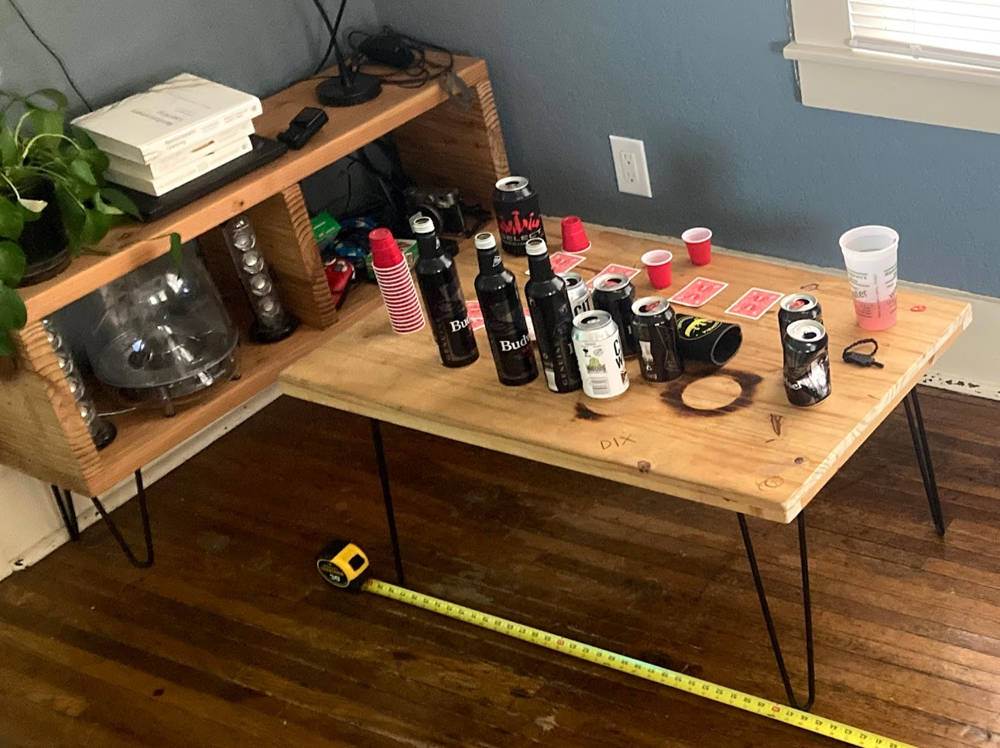

+++
title = "woodwork"
date = 2023-04-10
menu = "main"
+++

I love building stuff out of wood. I love natural materials, and wood is special because it's perfectly imperfect. Getting a naturally curvy material to make 90 degree corners and straight lines is tough, especially with limited tools (most of this was done with a drill, circ saw, and palm sander). Like with any DIY, I love how I can custom design everything to fit my needs.

*Not very complicated, but hey, that's the joy of doing it yourself. I custom build that console to fit my speakers, and designed it so that I could get the Home Depot dudes to cut it for me (notice the cut ends stick out, so they don't need to be perfect) and the coffee table has some custom "artwork" made by wood burning and such.*

&nbsp;

*I carried this plywood home from the lumber yard across the street. Even 200 meters of walking with plywood is a major PITA. I built that microwave too, it's actually a high-performance Deep Learning rig (mainly used for gaming).*

&nbsp;

*Built this out of plywood after looking up cool nightstands, saw one similar to this for $400 from Australia, figured I could do it myself. It's a box, with a smaller box that slides out! Very cool.*

&nbsp;

*Finally, not a box! Built this squat rack to use with my barbell and weights. Inspector Mikey does not care one bit about squatting.*

&nbsp;

*This is a massive wooden sculpture, 16ft (4.9m) tall, 32ft (9.8m) wide. I was lead creative builder, I cut all that wood out by hand using a pencil and jig saw.*

&nbsp;

*Seeing as most woodworking is just building boxes, I'm also pretty good at framing.*

